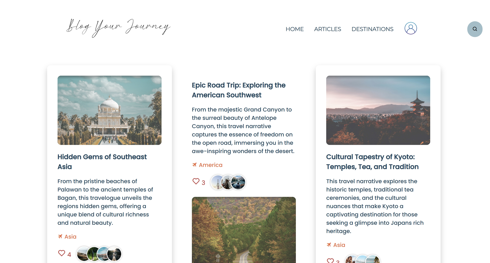
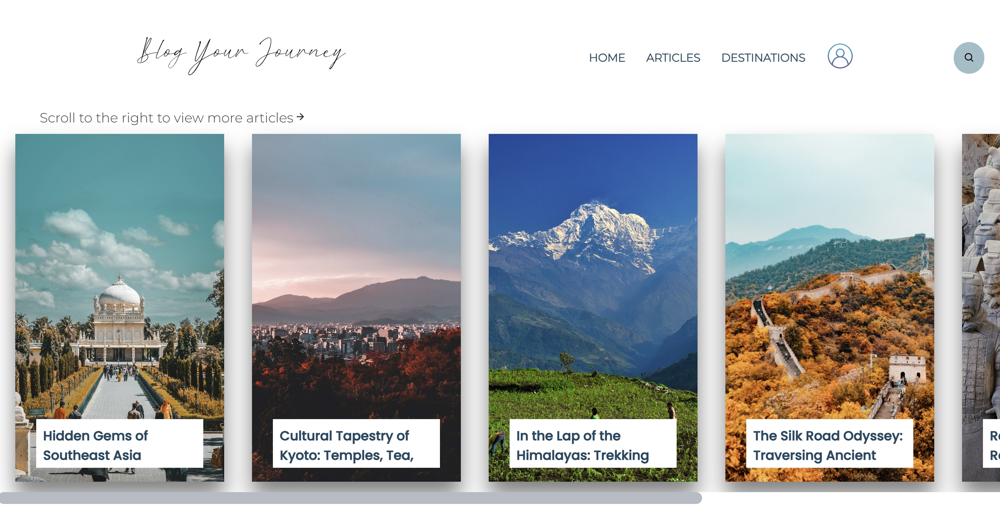
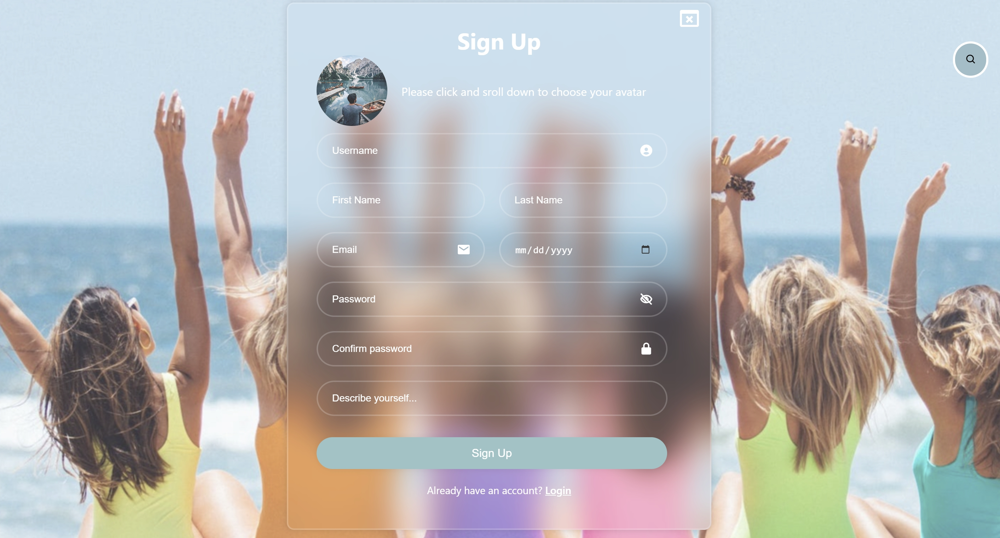

# A personal blogging system 

 
 
 
 
 
 
 
 

  

## Table of Contents 

- [About](#about)
- [Main Features](#main-features)
- [UI Preview](#ui-preview)
- [Quick Start](#quick-start)
- [Collaborators](#collaborators)

 
---
## About

This is a group project where we created a personal blogging system called "Blog Your Journey". This pilot website caters to travel enthusiasts, offering a platform to browse articles of interest and write their own to share personal journeys with the world.

 

## Main Features

- Visitors can easily browse all articles or search and sort articles.
- Users can create their accounts and build up their own blogging pages, showcasing their personal information and the articles they created. 
- Articles can be created using a user-friendly editor that allows for text formatting.  
- Other registered users can engage with articles by liking them and leaving comments. 
- Users can also choose to show or hide comments for a better reading experience.
- A responsive UI design that adapts to different screen sizes 

 

## UI Preview

  
  
  

 

For the demo video, please refer to [the link here](https://drive.google.com/file/d/1YB70KMBh1vlhGcaGgWhrpDxcYgTXJ2bd/view?usp=sharing).

 

## Quick Start
 
- Clone the repository 
- Open the project in VSCode
- Navigate to the frontend folder and execute `npm install` to install the module dependencies. Then run `npm run dev`.
- Navigate to the backend folder and execute `npm install`and `npm run dev`.

**Recommendation:** Please use **CHROME** for better experience~

 

## Collaborators

Our group, **"The Coding L-A-R-K"**, includes four members: **L**esley, **A**lan, **R**ita, **K**iko. Thanks to our seamless teamwork, constant communication, and valuable feedback, we successfully met our expectations. 
